# Scope And Taxonomy

## Why This Is A Separate Dimension

前一轮研究的大多数项目是 agent 层面的 harness：它们关心 model call、tool call、sandbox、approval、memory、trace、eval 等运行时问题。软件开发层 harness 站在更外层，关心“一个软件需求如何被 agent 安全地交付到主干”。

两者关系：

| 层级 | 典型问题 | 典型对象 |
| --- | --- | --- |
| Agent/runtime harness | 模型如何调用工具、何时请求批准、如何记录 trace、如何恢复任务 | Codex CLI、Claude Agent SDK、DeepAgents、OpenHands SDK |
| Software development harness | 需求如何拆任务、任务如何隔离执行、PR 如何 review、CI 如何阻断、证据如何沉淀 | GitHub Actions、worktree managers、Task Master、BMAD、Superpowers |
| Evaluation harness | 如何可复现地判断模型/agent 是否完成任务 | Inspect AI、SWE-bench、Terminal-Bench |

软件开发层 harness 不一定自己实现 agent loop。它更常见的做法是“调用已有 coding agent”，再把其执行纳入工程流程。

## What Counts

符合本研究范围的项目一般满足至少一条：

- 基于 Claude Code、Codex、Copilot、Cursor、Gemini CLI、OpenCode、Aider 等 coding agent 做编排。
- 把 issue、PR、CI、worktree、branch、review、测试结果接成闭环。
- 把需求、PRD、任务依赖、计划批准、验收证据落到 repo 或外部任务系统。
- 提供技能、插件、slash command、hook、subagent 角色，强制工程流程。
- 管理多个 agent 会话，让每个任务在独立 worktree/branch 中运行。

## What Does Not Count

- 单纯的 prompt 模板库，除非它被安装成技能/命令并进入执行流程。
- 只评测模型能力的 benchmark，除非它直接用于 PR/CI 或开发质量门。
- 只提供模型 API adapter 的 SDK，除非它绑定开发流程。
- 纯聊天 UI，除非它能管理代码分支、任务、review 或 CI。

## Lifecycle View

一个完整的软件开发层 harness 通常覆盖以下生命周期：

```mermaid
flowchart LR
  A["Idea / Issue"] --> B["Spec / PRD"]
  B --> C["Task Graph"]
  C --> D["Plan Approval"]
  D --> E["Worktree + Branch"]
  E --> F["Agent Execution"]
  F --> G["Tests / CI Evidence"]
  G --> H["Diff Review"]
  H --> I["PR Creation"]
  I --> J["Human / AI Review"]
  J --> K["Merge / Release"]
  K --> L["Memory / Postmortem"]
```

这个生命周期里，Claude Code/Codex 只是 `Agent Execution` 的执行器。harness 的价值在于让前后状态不丢失，并让每一步有边界和证据。

## Taxonomy

### 1. CI/PR Harness

代表：`openai/codex-action`、`anthropics/claude-code-action`、PR-Agent。

特点：

- 入口是 GitHub Actions、issue comment、PR event、label、assignment。
- 运行在 CI runner 上，天然有权限、secrets、网络、日志和审计问题。
- 适合 review、修复小 bug、自动 triage、生成 PR 描述、维护文档。

设计原因：

- GitHub 已经是多数团队的软件交付控制面。
- PR/issue 天然有 review、权限、审计和协作语义。
- CI runner 可以提供相对标准化的执行环境。

### 2. Worktree/Workspace Harness

代表：Vibe Kanban、Claude Squad、Crystal/Nimbalyst。

特点：

- 每个任务一个 git worktree 或 branch。
- 为 agent 提供 terminal、dev server、diff preview、review UI。
- 支持多 agent 同时跑，用户在“计划和 review”层面工作。

设计原因：

- agent 并行会造成文件冲突，worktree 是 Git 原生隔离机制。
- 终端和 diff 是 coding agent 最自然的执行/观察接口。
- 人类瓶颈从写代码变成任务切分和 review。

### 3. Requirement/Task Harness

代表：Task Master AI。

特点：

- 把 PRD 解析成任务、子任务、依赖、优先级。
- 提供 CLI/MCP，让 Claude Code/Codex/Cursor 等读取下一步。
- 把任务状态沉淀在 repo 或项目目录中。

设计原因：

- coding agent 最大问题之一是需求漂移和上下文丢失。
- 任务数据库可以作为“工程意图的单一事实源”。

### 4. Methodology Harness

代表：BMAD Method、Superpowers。

特点：

- 提供从 brainstorming、PRD、architecture、implementation、review 到 release 的流程。
- 常用技能、角色、命令、session-start hooks 注入行为。
- 强调需求批准、TDD、review、证据和收尾。

设计原因：

- 单次任务 prompt 很难稳定传播团队工程纪律。
- 方法论被打包成可安装资产后，可以跨 agent 重用。

### 5. Agent Configuration/Plugin Harness

代表：SuperClaude、Ruflo/Claude Flow、Superpowers、Codex/Claude plugin ecosystems。

特点：

- 使用 plugins、skills、slash commands、hooks、MCP、memory 扩展 Claude Code/Codex。
- 有些项目偏轻量命令包，有些项目演化成完整多 agent control plane。

设计原因：

- 官方 agent 本身趋向通用，团队需要可版本化的行为层。
- 插件/技能比复制 prompt 更容易维护、审查和更新。

## Core Design Questions

设计软件开发层 harness 时应先回答：

1. 任务状态放在哪里：issue、repo 文件、数据库、kanban，还是三者同步？
2. 每个任务是否必须使用独立 worktree/branch？
3. agent 的权限由谁决定：GitHub permissions、Codex/Claude sandbox、hook、人工批准，还是 MCP 工具白名单？
4. 什么算完成：测试通过、review 无阻断、验收 checklist、CI artifact，还是人工批准？
5. 如何处理失败：重跑、回滚、创建 follow-up task、压缩上下文，还是交给 reviewer？
6. 如何留下证据：diff、test logs、trace、PR comment、task history、memory。
