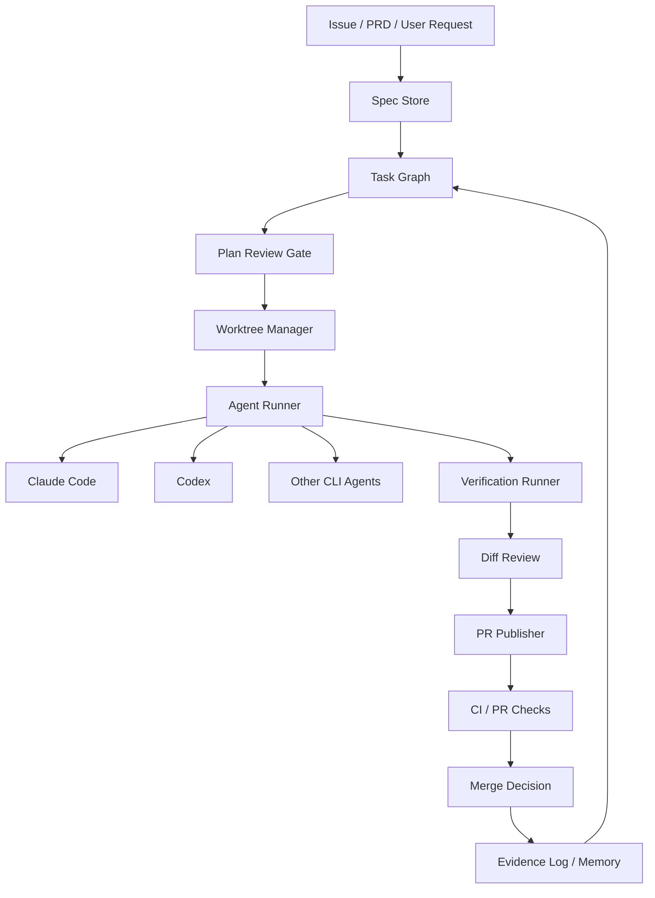

# Patterns And Architecture

## Common Patterns

### 1. Repo Knowledge As System Of Record

代表：Codex `AGENTS.md`、Claude `CLAUDE.md`/project docs、Task Master `.taskmaster/`、BMAD planning artifacts。

做法：

- 把 coding standards、测试命令、目录说明、release 规则放进 repo。
- 让 agent 每次启动都能读到稳定约定。
- 对大型项目，需求和任务也落入 repo，而不是只留在聊天里。

为什么重要：

- agent 会话会重启、压缩、分叉；repo 文件比聊天上下文更稳定。
- review 可以审查这些约定的变化。

### 2. Worktree Per Task

代表：Vibe Kanban、Claude Squad、Superpowers。

做法：

- 每个任务创建独立 branch/worktree。
- agent 在该 worktree 中运行。
- 完成后 review diff，再选择 merge/PR/discard。

为什么重要：

- 多 agent 并行时，文件冲突是第一风险。
- worktree 是 Git 原生隔离，不需要重造虚拟文件系统。

### 3. Issue/PR As Control Surface

代表：Claude Code Action、Codex Action、PR-Agent、GitHub Agent HQ。

做法：

- 用 issue、PR comment、label、assignment 触发 agent。
- 用 PR comment、review、status check 返回结果。
- 用 GitHub permissions 和 Actions secrets 控制能力。

为什么重要：

- 团队已经在 GitHub 上讨论、审查和合并代码。
- 让 agent 进入现有流程，比新建独立协作系统更容易落地。

### 4. Plan Before Execution

代表：Task Master、BMAD、Superpowers。

做法：

- 从 PRD 或对话中生成 spec。
- 用户批准设计和任务计划。
- agent 只执行已批准计划，变更需要回到计划层。

为什么重要：

- 大多数失败不是模型不会写代码，而是目标漂移、隐含约束没被捕获。
- 计划批准把人类判断放在高杠杆位置。

### 5. Deterministic Verification Gates

代表：GitHub Actions、Superpowers TDD、PR-Agent、Codex/Claude hooks。

做法：

- 测试、lint、typecheck、secret scan、license scan、coverage、security check 由命令执行。
- agent 可以解释结果，但不能用“看起来好了”替代证据。

为什么重要：

- LLM review 是概率性的；测试/CI 是确定性或半确定性的。
- 完成标准必须可复查。

### 6. Skill/Plugin Packaging

代表：Superpowers、SuperClaude、Ruflo、Claude Code plugins、Codex skills。

做法：

- 把流程做成 skills、commands、plugins、hooks。
- 通过 Git 或 marketplace 分发。
- 团队可以版本化、审查、更新。

为什么重要：

- prompt 复制不可维护。
- 技能包是工程纪律的发布单位。

### 7. PR-Diff Compression And Review Boundary

代表：PR-Agent、Codex Action PR review example、Claude Code Action review mode。

做法：

- 只让 review agent 看 PR 引入的 changes。
- 压缩大 PR diff，按文件和风险排序。
- 输出 review comments、suggestions、labels、summary。

为什么重要：

- 评审问题天然围绕 diff，不应让 agent 随意改全仓。
- review harness 可以独立于 implementation harness。

### 8. Memory With Caution

代表：Ruflo/Claude Flow、Task Master、SuperClaude、Codex/Claude session memory。

做法：

- 保存成功模式、项目知识、任务历史。
- 对事实性工程约定优先写入 repo，而不是只写向量记忆。
- memory 应该可审计、可清理、可命名空间隔离。

为什么重要：

- 记忆能减少重复解释，但也可能传播过期或错误假设。

## Reference Architecture

如果我们要自建一个“基于 Claude Code / Codex 的软件开发层 harness”，推荐先做轻量、可替换的 control plane：



## Minimal MVP

第一版不要做复杂多 agent swarm。建议 MVP：

1. `specs/`：每个需求一个 markdown spec，含目标、非目标、验收标准。
2. `tasks/`：每个 spec 生成任务清单，含依赖和验证命令。
3. `worktrees/`：每个任务自动创建 branch/worktree。
4. `runner`：可选 `codex exec` 或 `claude`，通过配置切换。
5. `verify`：执行 repo-defined tests/lint/typecheck。
6. `review`：调用 PR-Agent 或 Codex/Claude review prompt，只审 diff。
7. `evidence`：保存命令、输出摘要、diff、review、人工批准。

## Control Plane Data Model

```text
Project
  id
  repo_path
  default_agent_profile
  verification_profile

Spec
  id
  title
  status: draft | approved | superseded
  acceptance_criteria

Task
  id
  spec_id
  status: planned | running | blocked | review | done | abandoned
  branch
  worktree_path
  agent_profile
  verification_commands

Run
  id
  task_id
  agent
  start_time
  end_time
  prompt_path
  transcript_path
  changed_files
  verification_result

Evidence
  id
  run_id
  type: test | lint | review | human_approval | ci
  path_or_url
```

## Policy Checklist

落地时每个 repo 应有：

- `AGENTS.md` 或 `CLAUDE.md`：编码规则、测试命令、review 标准。
- `harness.toml`：允许 agents、默认 sandbox、允许 MCP、验证命令。
- `security.md`：不可信输入、secrets、外部 contributor、runner 权限策略。
- `review-checklist.md`：哪些问题阻断 merge。
- `templates/`：spec、task、PR description、review prompt。

## Recommended Combination

短期可以组合现成工具：

| 需求 | 推荐组合 |
| --- | --- |
| GitHub PR review bot | `openai/codex-action` 或 `claude-code-action` + PR-Agent 思路 |
| 多任务本地并行 | Claude Squad 或 Vibe Kanban 的 worktree 模式 |
| 需求到任务 | Task Master AI 或简化版 task graph |
| 工程纪律 | Superpowers 的 plan/TDD/review/finish branch 技能 |
| 方法论重项目 | BMAD Method |
| 多 agent 研究 | Ruflo/Claude Flow，但应先小范围验证 |
