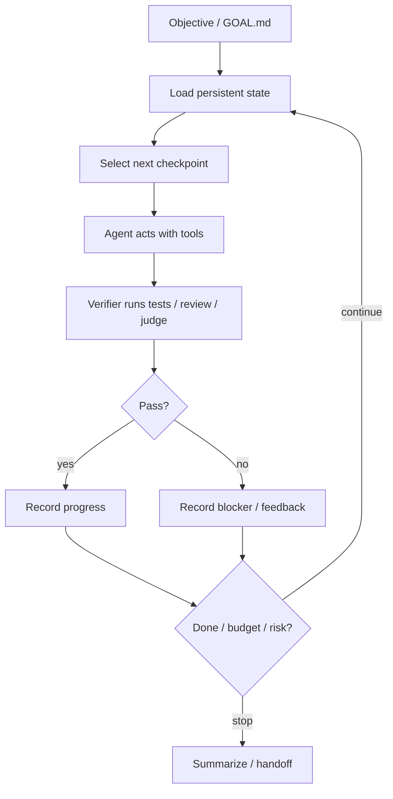

# Loop Engineering 定义

## 一句话定义

Loop engineering 是设计 agent 的外层反馈控制系统：让 agent 在明确目标、持久状态、验证信号、预算约束、安全边界和停止条件下持续迭代，而不是靠人一次次手动提示。

它的关键转变是：

```text
Prompt the agent -> Design the loop that prompts, checks, resumes, and stops the agent
```

## 与 prompt engineering 的区别

Prompt engineering 关注“这一轮怎么说”。Loop engineering 关注“多轮怎么运行”。

| 维度 | Prompt engineering | Loop engineering |
| --- | --- | --- |
| 时间尺度 | 单轮或短会话 | 长任务、多轮、跨重启 |
| 状态 | 多在上下文窗口里 | 磁盘/数据库/PR/issue/run log |
| 成功标准 | 模型回答好不好 | 是否持续推进到可验证完成 |
| 控制点 | 指令、示例、格式 | 迭代、验证、预算、恢复、停止 |
| 风险 | 幻觉、歧义 | 失控循环、成本爆炸、错误提交、权限泄漏 |

## 与 harness engineering 的关系

Harness 是 agent 能运行的外壳：模型、工具、权限、sandbox、session、logging、hooks、MCP。Loop 是 harness 之上的行为闭环：目标、计划、反馈、验证、恢复、停止。

简单说：

- harness 解决“agent 能安全地做什么”；
- loop 解决“agent 要持续做什么、做到什么时候、怎么知道做对了”。

一个 loop 没有 harness 会很危险，因为它会重复放大工具权限。一个 harness 没有 loop 则往往停留在强大的交互式助手，而不是可托付的长任务系统。

## 与 context engineering 的关系

Loop engineering 很大一部分是在处理 context 衰减：

- 每轮 fresh context，避免上下文腐烂；
- 把长期状态移到文件/数据库；
- 用 survival guide、execution log、learnings、PLAN.md 让 agent 可恢复；
- 用 subagents 承担探索，把主上下文留给调度和决策；
- compaction/restart 后从持久状态重建工作记忆。

## 与 eval engineering 的关系

Eval 是 loop 的方向盘和刹车。没有 eval/verification 的 loop 只是自动重复；有了可执行验证，loop 才能判断：

- 是否继续；
- 是否回滚；
- 是否换策略；
- 是否升级给人类；
- 是否已经完成。

OpenAI Codex 的 long-running use case 强调给 Codex 一个 evaluation system，让它按分数或可审查产物持续改进。Anthropic 的 evaluator-optimizer workflow 则把“生成 -> 评价反馈 -> 改进”作为明确的 agent 工作流。

## 最小 loop 结构



## 好 loop 的判据

一个 loop 不是因为“能一直跑”而好，而是因为它能：

- 持续推进真实目标；
- 在错误时产生可用反馈；
- 能解释自己做了什么；
- 能恢复；
- 能停下；
- 能把风险限制在预期边界内；
- 能让人以 review/merge/approve 的方式介入，而不是时时盯着终端。

